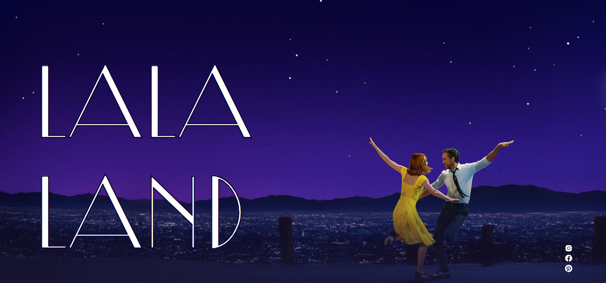

<h1 align="center">
La la land - uma landpagede um fã  
</h1>

    

  <a href="#tecnologias">Tecnologias</a>&nbsp;&nbsp;&nbsp;|&nbsp;&nbsp;&nbsp;
  <a href="#projeto">Projeto</a>&nbsp;&nbsp;&nbsp;|&nbsp;&nbsp;&nbsp;
  <a href="#desafio">Desafio</a>&nbsp;&nbsp;&nbsp;|&nbsp;&nbsp;&nbsp;
  <a href="#o-que-aprendi">O que aprendi</a>&nbsp;&nbsp;&nbsp;&nbsp;&nbsp;&nbsp;

## 🚀 Tecnologias

Esse projeto foi desenvolvido com as seguintes tecnologias:

- HTML
- sass
- JavaScript
- Gulp e plugins
- Git e Github

## Projeto

Como uma landpage um filme, o desafio principal é estruturar as seções e deixar de um modo que seja uma experiência que chame o usuário a assistir o filme. como base o projeto teve inspiração de um layout da <a href="https://www.behance.net/gallery/179313089/Movie-poster-Improving-skills-with-Uprock-school?tracking_source=search_projects|Lalaland">Behance</a>

## Desafio

Como parte de um exercicio, o desenvolvedor deve ser capaz de:

- Criar um layout responsivo
- Criar uma de paineis, onde mostre os videos um ao lado do outro, e no mobile fazer com que cada um ocupe a largura toda

Veja o resultado através do <a href="https://lala-land-fanpage.vercel.app/">link do Vercel</a>

## O que aprendi

Com o objetivo de praticas mais a estruturação do css, com sass:

- Criar layouts responsivos com sass e a organiza-lo
- Utilizar a metodologia BEM para estruturar os nomes das classes e utiliza-las junto com o pré-processador
